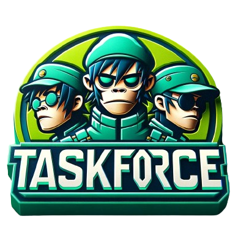

<div align="center">



# **TaskForce**

🤖 **TaskForce**: A community based framework around [CrewAi](https://crewai.com/) for collaborating AI agents.

[](https://opensource.org/licenses/MIT)

</div>

## Getting Started

To get started with TaskForce,

Options:

- Run inside the dev container
- Install the dependencies locally

## Contribution

TaskForce is open-source and we welcome contributions. If you're looking to contribute, please:

- Fork the repository.
- Create a new branch for your feature.
- Add your feature or improvement.
- Send a pull request.
- We appreciate your input!

### Installing Dependencies

```bash
poetry lock
poetry install
```

### Virtual Env

```bash
poetry shell
```

### Pre-commit hooks

```bash
pre-commit install
```

### Running Tests

```bash
poetry run pytest
```

```bash
make run-tests
```

## License

TaskForce is released under the MIT License.
